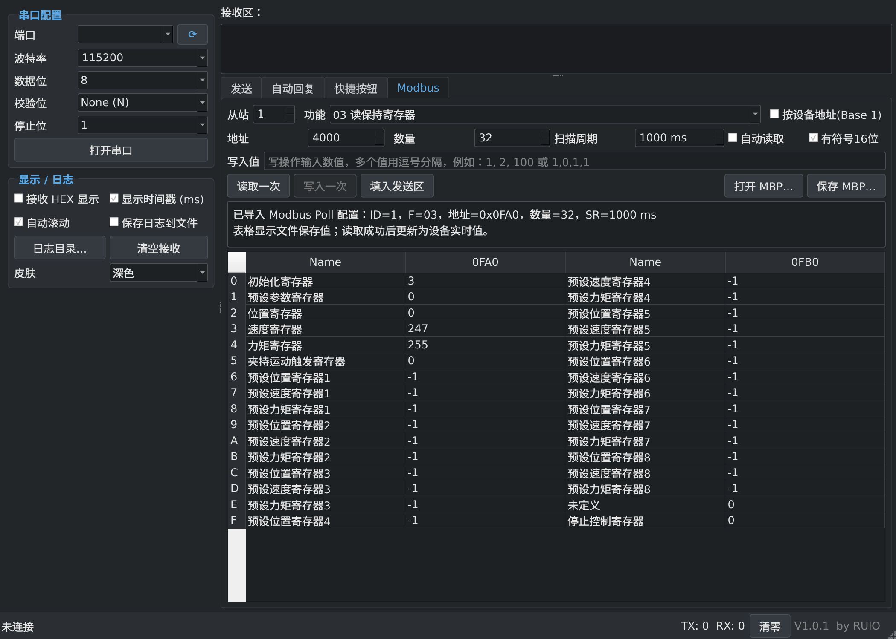

# DebugTool

启动入口为 `main.py`，打包程序名为 `DebugTool`。版本保持 V1.0.2。为兼容原有设置，继续使用 `serial_tool.ini`、`qt5com` 配置目录及 Modbus 配置格式；T113 的服务名和部署路径也保持兼容。

一个基于 **Python 3 + PyQt5 + pyserial + Paramiko** 的跨平台串口、SSH、TCP / UDP 调试工具，打包后为便携式可执行程序。

- **版本**：V1.0.2
- **作者**：RUIO
- **协议**：MIT License

---


主图为 V1.0.1 实际界面：已导入夹爪 MBP，显示文件保存的 32 项寄存器数据，尚未连接设备。

## ✨ 功能特性

1. **串口管理**：启动自动扫描一次，默认过滤不存在、无权限、虚拟或内核未检测到硬件的端口；`⟳` 按钮手动刷新，“显示全部”可查看被过滤端口及原因。支持完整的 数据位 / 校验位 (None/Even/Odd/Mark/Space) / 停止位 配置。
2. **波特率**：下拉常用值（1200 ~ 921600），也可直接输入自定义数字。
3. **发送能力**：
   - HEX / 文本 发送，可附加 `\r\n`
   - **循环发送**（10 ms ~ 600000 ms 可调）
   - 支持 **附加校验**：`SUM` / `XOR` / `CRC16-Modbus` / `CRC16-CCITT`，可指定参与计算的起止字节（1-based，止=0 表示到末尾）
4. **毫秒级日志**：接收/发送均带 `[HH:MM:SS.mmm]` 时间戳；可勾选“保存日志到文件”，按日期写入 `logs/YYYY-MM-DD.log`。
5. **自动回复**：表格式规则，每条独立启用开关；匹配与发送均可独立选择 HEX 或文本。
6. **快捷按钮**：自定义名称的一键指令按钮，持久保存，每条可独立设置 HEX / 附加换行。
7. **Modbus RTU**：新增 Modbus 标签页，基于现有串口连接支持 `01/02/03/04/05/06/15/16` 功能码，可直接构帧、发送、解析响应，也可一键填入发送区作二次编辑。
8. **MBP 文件**：支持直接打开 Modbus Poll 样例 `mbp/夹爪.mbp`，恢复从站、功能码、起始地址、数量、扫描周期、中文名称及保存值；也支持保存/打开本工具的 JSON `.mbp` 配置。
9. **界面皮肤**：浅色 / 深色 皮肤切换，Fusion 风格 + 自定义 QSS。
10. **配置文件**：默认为程序同目录的 `serial_tool.ini`（便携化）；若程序所在目录不可写，会自动回退到用户目录（Linux/macOS: `~/.config/qt5com/`，Windows: `%APPDATA%\qt5com\`）。自动保存端口参数、显示选项、历史发送、自动回复规则、快捷按钮、Modbus 表单、窗口布局等；**历史发送** 可从下拉框快速调出。

---

## 🚀 快速开始

### 源码运行

需要 Python 3.10 或更高版本。

全志 T113 精简 Ubuntu 的独立 Python/Qt 环境、800×1280 竖屏启动方式和
实机验证范围见 [T113 部署说明](deploy/t113/README.md)。桌面打包产物不能直接用于 ARM。

```bash
python3 -m venv .venv
.venv/bin/python -m pip install -r requirements.txt
python3 main.py
```

直接运行 `main.py` 时会自动使用项目 `.venv`（若存在），无需先激活环境；编辑器选择其他 Python 也可启动。Windows 安装依赖时使用 `.venv\Scripts\python.exe`。

Linux 使用 Fcitx 时，若虚拟环境 Qt 缺少 Fcitx 插件，源码启动会优先选用已安装且兼容当前 Python 的系统 PyQt5，避免混用不同 Qt 补丁版本的输入法插件；其他依赖仍使用虚拟环境，不修改系统配置。

### 串口终端（USB / UART，无需 IP）

1. 左侧选择设备（如 `/dev/ttyUSB0`），按设备要求设置波特率及帧格式（常见 `115200 / 8N1`），打开串口。
2. 切到 **串口终端**。设备未主动输出时会显示等待提示；Linux shell 可点击 **刷新提示符**（Ctrl+L）重绘当前命令行，不会发送 Enter。需要登录时再按 **Enter** 等待 `login:`。
3. 按提示直接输入用户名、密码并回车。字符实时发送，由设备决定是否回显；本地不记录终端发送内容或输入历史，若设备主动回显密码，回显仍属于接收数据。
4. 登录后直接输入 Linux 命令；**Tab** 补全、**↑/↓** 远端历史、**Ctrl+C** 中断、**Ctrl+Shift+C/V** 复制/粘贴。Enter 默认 CR，可切换 LF/CRLF；退格默认“自动 / vi 兼容”（Ctrl+H / 0x08），跟随远端 DECBKM 设置，也可手动固定 BS 或 DEL；选择会保存。单次粘贴限 4096 字节。

输入恢复：修改串口终端的回车/退格设置后，焦点会自动回到终端。输入法状态残留时，Esc 或 Ctrl+C 可解除预编辑拦截；也可右键选择“恢复键盘输入（仅本地）”，清理本地输入状态且不向设备发送任何字节。

终端绘制按相同样式的连续 ASCII 文本合并，减少满屏输出时的绘制开销；中文和组合字符仍按终端单元定位。串口没有自动窗口尺寸协商，请在 shell 提示符下点击“同步尺寸”后再进入 vi；不要在编辑器内发送尺寸命令。

vi 使用提示：先按 `i` / `a` 进入插入模式再输入、退格，`Esc` 返回命令模式。自动退格兼容远端 `stty erase ^H` 的 vi；若登录提示符要求 `0x7F`，可在底部退格选项选择 **DEL**。Backspace 与 Delete 独立编码，不会同时发送两个删除字节。如果 Vim 仅不能删除进入插入模式前的旧内容，可在 Vim 中使用 `:set backspace=indent,eol,start`（这是编辑器的删除范围设置，不适用于所有 BusyBox vi）。

串口终端与 SSH 共用 ANSI/VT 终端显示，支持颜色、光标定位、清屏、备用屏幕及 2000 行滚动历史，可显示 `top` 等终端界面。共用左侧已打开的串口，不需要 IP 或 SSH 服务；设备必须提供串口控制台。串口无法像 SSH 一样传递窗口尺寸：登录 Linux、回到 shell 提示符后，点击 **同步尺寸**，会发送当前行列数的 `stty` 命令，并设置 `TERM`、`COLUMNS` 和 `LINES`。窗口大小变化后需再次点击；按钮下拉菜单仍提供 **复制尺寸命令**。连接和缩放窗口不会自动发送 shell 命令，非 Linux 设备请勿点击同步。

如果 `ps aux` 的命令列被截断，先同步尺寸并重新运行；要查看不限制宽度的完整命令行，使用 `ps auxww`。远端已截断的旧输出无法由本地恢复，需重新执行命令。

进入串口终端会停止循环发送、自动回复及 Modbus 自动读取；仅在此页激活时响应设备的终端查询。发送不附加 HEX 转换或校验和。原接收区、计数和文件日志仍可使用，终端发送日志只记录字节数；断开及同一串口、同一波特率重连后保留最后的屏幕供排查，切换串口或波特率则清空旧画面。重连不会让远端自动重发提示符，保留的画面不代表新收到的数据。

### TCP / UDP 网络调试

在左侧 **连接配置** 下拉框选择 **串口 / TCP 客户端 / TCP 服务端 / UDP**，只显示当前模式需要的连接参数。各种模式共用主窗口的发送、接收、HEX、收发计数及“显示 / 日志”设置。SSH 保留独立终端。切换模式会关闭原连接并停止循环发送；收发区内容和累计计数保留，可手动清空。

- **TCP 客户端**：填写目标 IP / 域名与端口，点击连接；10 秒连接超时。
- **TCP 服务端**：填写本地 IP、端口并开始监听；`0.0.0.0` 监听所有 IPv4 网卡，端口 `0` 自动分配，实际端口显示在状态栏。最多 16 个客户端，可选择单个发送、断开，或向全部客户端发送。
- **UDP**：先绑定本地 IP、端口，再填写目标 IP 与端口收发数据。支持 IPv4 / IPv6 单播及 IPv4 广播；目标需填写 IP，暂不提供域名解析及组播加入。接收日志逐个记录数据报及来源地址。
- 在共用“发送”页输入 UTF-8 文本或 HEX（例如 `01 03 00 FF`），支持附加 CRLF、校验和、发送历史、快捷按钮及循环发送。格式错误或发送失败会停止循环发送。网络模式下自动回复、Modbus RTU 和串口终端不可用，切回串口即可使用。
- TCP 是字节流，接收块不等于协议报文；跨块中文使用增量解码。TCP 的 TX 表示已入本地发送队列，不代表对端应用已处理。显示限制为最近 2000 行 / 512 KiB 字符；勾选左侧“保存日志到文件”后，完整收发日志写入所选日志目录，不受显示截断影响，包含协议和对端地址。TCP 每连接收发缓冲上限 256 KiB，发送队列满时停止循环发送。
- 保存模式、地址、端口与共用循环间隔，发送内容沿用主窗口历史保存规则。重新启动不会自动连接或循环发送，关闭连接、切换模式或退出程序会释放套接字。

回归测试：`QT_QPA_PLATFORM=offscreen .venv/bin/python -m unittest discover -s qa -v`（需允许本机回环套接字）。

### SSH 命令终端（网络连接，需要 IP）

- 切换到 **SSH（网络）** 标签页，填写主机 IP / 域名、端口（默认 22）、用户名和密码，点击 **连接 SSH**。SSH 与串口可以同时连接，收发区互相独立。
- 可选择私钥文件；此时密码框用于输入私钥口令。密码及口令不写入配置文件。留空密码及私钥时，尝试默认密钥或 SSH Agent。
- 首次连接显示服务器 SHA256 指纹，核对后确认信任，保存到配置目录的 `ssh_known_hosts`；也读取系统用户的 SSH 已知主机记录。已知主机密钥变化会拒绝连接。
- 连接后点击终端区域直接输入，**Enter** 执行、**Tab** 补全、**↑/↓** 调出远端 shell 历史、**Ctrl+C** 中断、**Ctrl+D** 发送 EOF。字符直接发送到远端，是否回显由远端控制，兼容密码提示及中文输入法提交。
- 支持 ANSI/VT 光标定位、清屏、颜色、备用屏幕和窗口尺寸同步，可交互运行 `top` 等终端程序。使用 `xterm-256color` PTY；暂不支持鼠标上报和图形协议。SSH 输出不进入串口日志、自动回复或 Modbus 解析。
- 鼠标拖选文本后 **Ctrl+Shift+C** 复制，**Ctrl+Shift+V** 或右键菜单粘贴；支持远端启用的 bracketed paste。滚轮或 **Shift+PageUp/PageDown** 查看历史，输入时回到当前屏幕。串口与 SSH 终端均支持拖选到上/下边缘时自动滚动、拖选中用滚轮扩展选区，以及右键“全选”或 **Ctrl+Shift+A**；选区采用浅蓝底深色字，避免 ANSI 颜色导致对比度不足。
- 保留最多 2000 行滚动历史，显示网格最大 240 列、120 行；连接、收发在后台执行。断开后可重新连接，关闭窗口会先结束 SSH 会话。
- 源码运行需保留项目的全部 `.py` 文件，依赖安装见上方源码运行步骤。现有旧版可执行文件需要重新打包才包含新功能。

### 发送历史管理

在“发送”标签页的历史下拉框旁，点击“删除所选”可移除当前记录，点击“清空历史”可清除全部记录。操作立即保存到配置文件，重启后仍生效，并保留发送区当前输入。再次发送（包括循环发送）会产生新的历史记录。

### 串口设备筛选

- 默认列表仅显示设备节点存在、当前用户具有读写权限，并且系统确认存在硬件的串口。Linux 的 `ttyS*` 先检查内核 UART 信息，再用当前终端参数做最小化配置探测：能够配置的真实板载串口会保留，返回 `EIO` 的幽灵端口会隐藏；探测不会发送应用数据。虚拟终端、失效节点以及本次运行中打开失败的端口也会被隐藏。USB 转串口（通常为 `ttyUSB*` 或 `ttyACM*`）正常显示。
- 勾选“显示全部”可排查特殊板载串口。被过滤的端口会标明原因，程序不会直接打开它们；该选项会保存到配置文件。
- 刷新时只会短暂打开内核确认存在的 `ttyS*`，读取并原样写回终端参数后立即关闭，用来排除配置时返回 `EIO` 的端口；不会发送应用数据。其他类型不会在刷新时打开。端口是否被其他程序独占仍只能在点击“打开串口”时确认，失败提示会说明可能的占用、断开或权限问题。
- Linux 若提示无读写权限，请将当前用户加入串口所属用户组（通常为 `dialout`），重新登录后再刷新。
- 程序允许同时启动多个独立窗口，但 Linux/macOS 会对已打开的串口启用系统级独占访问。同一个串口不能被本程序的第二个实例重复打开，其他实例仍可打开不同串口；Windows 由系统串口驱动执行同等限制。

### Modbus 使用

#### 直接使用夹爪配置

1. 启动程序，切到 **Modbus** 标签页，点击 **打开 MBP…**，选择仓库中的 `mbp/夹爪.mbp`。
2. 确认从站为 `1`、功能码为 `03`、起始地址为 `4000`、数量为 `32`；此配置不勾选 Base 1。
3. 按设备设置选择串口、波特率、数据位、校验位和停止位，点击 **打开串口**。
4. 点击 **读取一次**，或勾选 **自动读取**，按 `1000 ms` 周期刷新表格。
5. 如需写入，双击目标寄存器，检查自动填入的地址并修改写入值，再点击 **写入一次**。双击后会停止自动读取并切换到单个写入功能；要恢复整组读取，可重新打开夹爪配置。

导入后的文件保存值可与 [Modbus Poll 参考截图](mbp/夹爪.png) 对照；保存值不代表当前设备状态。

#### 新建与编辑 MBP

- 新建：选择从站、读功能码（01/02/03/04）、起始地址、数量和扫描周期，点击“新建 MBP”。这会用当前参数建立名称为空、数值为 0 的新表格，并替换当前表格。
- 修改：打开已有 MBP，勾选“编辑配置”，双击 Name 或数值单元格修改；支持十进制、`0x` 十六进制，有符号显示下可输入 `-1`。空值表示未知，非法值会恢复原值。
- 清空：勾选“编辑配置”，选中名称或值单元格后点击“清空所选项”。可用 Ctrl/Shift 多选；同一寄存器的名称和值一起清空，值显示为“未知”，地址和数量不变。左右两组同一显示行对应不同寄存器，按所选单元格分别处理。
- 缩减：点击“缩减末尾项…”，输入要保留的数量。只保留前面的寄存器及其名称和值，自动同步读取的从站、功能码、起始地址和数量；至少保留 1 项。取消对话框不会修改配置。
- 点击“保存 MBP…”保存，文件名未填扩展名时自动补 `.mbp`。重新打开可恢复名称、数值和配置。
- 编辑期间暂停自动读取；退出“编辑配置”后可继续设备读写。编辑或保存文件不会向设备写入数据。
- 保存格式为兼容旧版的 QT5COM JSON `.mbp`，Modbus Poll 二进制文件可导入后编辑并另存为此格式；如需保留原生文件，请使用不同文件名另存。

#### 功能与格式说明

- 打开串口后切到 `Modbus` 标签页，选择从站、功能码、地址与数量/写入值。
- `读取一次` / `写入一次` 会直接经当前串口发送 Modbus RTU 帧并解析响应。
- `填入发送区` 会把当前配置转成 HEX 帧，便于继续手工调整。
- `打开 MBP…` 支持两类文件：
  - 本工具保存的 JSON `.mbp`：完整恢复 Modbus 配置。
  - Modbus Poll 二进制 `.mbp`：已验证样例使用的 `0x2454 / 0xA8` 布局，未知版本或损坏文件会提示导入失败。
- 夹爪样例导入后为从站 `1`、功能码 `03`、起始地址 `4000 (0x0FA0)`、数量 `32`、扫描周期 `1000 ms`，按截图分两组显示名称和数值。文件中的值是保存时的快照，读取成功后由设备响应刷新。
- 勾选“有符号16位”时，`65535 (0xFFFF)` 显示为 `-1`；写入表单使用原始无符号值 `0~65535`。
- 打开串口后可勾选“自动读取”，按扫描周期读取；等待响应期间不重发，超时提示后继续下一轮，关闭串口自动停止。串口端口、波特率、校验位仍需按设备设置。
- 双击保持寄存器/线圈表格项可填入单个写入表单，修改值后点击“写入一次”发送。
- “填入发送区”仅生成帧，不会发送；打开和保存配置也不会写入设备。
- 保存为本工具 JSON `.mbp` 时保留名称、保存值、扫描周期及显示选项；该 JSON 格式不用于 Modbus Poll 回读，原始二进制样例不受影响。

回归测试：`python3 -m unittest discover -s tests -v`（含无显示环境下的 Qt 界面测试）。

### Linux 权限
```bash
sudo usermod -aG dialout $USER     # 重新登录生效
```

### 打包为单文件可执行程序
```bash
python3 build.py            # 产物: dist/DebugTool-V1.0.2[.exe|-linux]
python3 build.py --clean    # 清理构建产物
```
- 打包前会自动调用 `gen_icon.py` 生成 `app.png` / `app.ico`（已存在则跳过）。
- Windows 自动为 EXE 嵌入版本资源（文件属性页可见版本号与作者）。
- Linux / Windows 均输出 `--onefile` 单文件，双击即可运行。

### 安装到系统（Linux）
```bash
sudo ./install.sh                 # 安装到 /opt/qt5com，创建桌面快捷方式
sudo ./install.sh --uninstall     # 卸载
```
安装后：
- 终端命令：`DebugTool`（保留 `qt5com` 兼容命令）
- 应用菜单：`DebugTool`
- 桌面图标：`/usr/share/pixmaps/qt5com.png`
  - 同时按 Freedesktop 图标主题规范安装到 `/usr/share/icons/hicolor/256x256/apps/qt5com.png` 并刷新缓存，兼容 XFCE、GNOME、KDE 等桌面菜单。GNOME 通过 `qt5com.desktop` 和 `StartupWMClass` 将菜单、Dock 与运行窗口归为同一应用。
- 配置文件：
  - 便携模式（程序所在目录可写时）：`<程序目录>/serial_tool.ini`
  - 系统安装（`/opt/qt5com`）普通用户不可写，配置会回退到用户目录。
  - 若安装目录不可写，则自动回退到用户目录：
    - Linux/macOS：`~/.config/qt5com/serial_tool.ini`
    - Windows：`%APPDATA%\qt5com\serial_tool.ini`
- `sudo ./install.sh --uninstall` 会同时清理 `/opt/qt5com` 以及各用户下的 `~/.config/qt5com/`

---

## 🎨 自定义图标
```bash
python3 gen_icon.py           # 重新生成 app.png / app.ico
```
如需安装 Pillow 才可生成 `.ico`：`pip install pillow`

---

## 📂 运行期目录结构
```
程序目录/
├── DebugTool-V1.0.2-linux  # Linux 可执行文件；Windows 为 DebugTool-V1.0.2.exe
├── serial_tool.ini           # 便携配置
└── logs/
    └── 2026-04-18.log        # 按日期归档日志
```

## 📝 日志示例
```
2026-04-18 10:30:45.123 TX -> AA 55 01 02
2026-04-18 10:30:45.180 RX <- OK\r\n
2026-04-18 10:30:46.050 TX(auto) -> PONG
```

---

## 更新记录

### V1.0.2

- 串口与 SSH 终端支持中文输入法预编辑和选词提交，候选框跟随光标；使用闪烁竖线光标。
- 新增独立 SSH 交互终端，支持密码/私钥登录、主机指纹确认、直接键盘输入和窗口尺寸同步。
- 新增串口交互终端，支持 ANSI/VT 显示、方向键、Tab、Ctrl+C、复制粘贴以及换行与退格配置。
- 源码启动时自动使用项目 `.venv`，避免解释器与依赖环境不一致。

### 2026-09-14 连续高速接收修复

- 接收线程每 20 ms 或累计 4096 字节交付数据，连续输入不再等待空闲才显示。
- 接收区改用轻量文本控件，关闭自动折行，保留最近 2000 行、最多 512K 字符，避免历史数据无限增长；开启文件日志可保存完整收发内容。
- 新增持续输入、分块限额、显示容量与日志完整性、伪串口界面响应测试。

### V1.0.1（2026-09-06）

- 修复 Modbus Poll 夹爪 `.mbp` 导入：正确解析起始地址、扫描周期、从站和全部 32 项中文名称及保存值。
- 增加寄存器分组表格、有符号 16 位显示、自动读取及双击填入单个写入表单。
- 修复 RTU 分包接收，补充 CRC、响应数量、写入回显校验及超时处理，避免等待响应期间重复发送。
- 修复“填入发送区”意外发送的问题，现在仅生成待发送帧。
- 保存和恢复配置时保留寄存器名称、保存值、扫描周期和显示选项。
- 修复深色主题文件对话框的文字对比度，统一文件列表、详细视图和侧栏背景，补充悬停与选中样式。
- 修复 XFCE 应用菜单和窗口可能不显示图标的问题，按 Freedesktop hicolor 图标主题规范安装并刷新缓存。
- 增加 7 项 Modbus 回归测试；已通过软件测试，实际设备通信仍需按硬件环境验证。

---

## 📜 License

本项目采用 **MIT License** 开源，详见 [LICENSE](LICENSE)。

```
Copyright (c) 2026 RUIO

Permission is hereby granted, free of charge, to any person obtaining a copy
of this software and associated documentation files (the "Software"), to deal
in the Software without restriction, including without limitation the rights
to use, copy, modify, merge, publish, distribute, sublicense, and/or sell
copies of the Software, and to permit persons to whom the Software is
furnished to do so, subject to the following conditions:

The above copyright notice and this permission notice shall be included in
all copies or substantial portions of the Software.

THE SOFTWARE IS PROVIDED "AS IS", WITHOUT WARRANTY OF ANY KIND.
```

---

## 👤 作者

**RUIO** — 欢迎 Issue / PR 与使用反馈。
